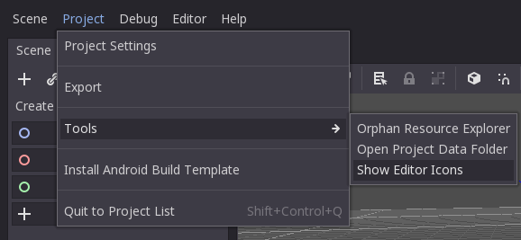
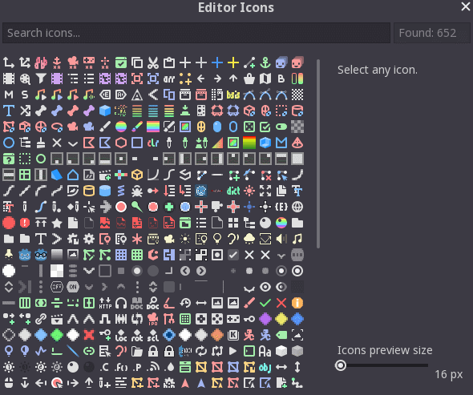

# Godot Editor Icons Previewer

Godot plugin which adds ability to preview all available icons in Godot Editor.
Can be used to facilitate the process of developing neat user interfaces for 
Godot editor plugins without the need to import any custom icons.

## Compatibility

Godot 3.0+ compatible. Note that in version 3.0, there's no menu option, but the
plugin is still accesible via a shortcut (see below).

## Usage

Navigate to `Project` > `Tools` and click `Show Editor Icons` menu option
(<kbd>Alt</kbd>+<kbd>I</kbd> shortcut is also available for this):



A window shall popup listing all available editor icons which Godot uses natively
(can also show icons from any custom C++ module):



Hovering on icons will show their internal name to be used when developing plugins.
In order to use the icon in your plugins, you can fetch it via code like so:

```gdscript
button.icon = get_icon('Add', 'EditorIcons')
```

To simplify the process even further, you can also get the above snippet by
right-clicking on an icon and it will be copied to your clipboard. Left-clicking 
just copies the raw icon's name.

## Caveats

1. In some cases, a control might not have a theme inherited from Godot's base
   control as it can be overriden. For a more sophisticated way on how to get an
   icon from Godot's base control, see
   [editor_plugin_utils.gd](https://github.com/Xrayez/godot-editor-plugin-tools/blob/master/editor_plugin_utils.gd).

2. The `get_icon()` method is meant to be used in `EditorPlugin`s. If you really
   want to use this in plain `tool` scripts from within the editor, an icon can
   be fetched with the following snippet:

   ```gdscript
    tool
    extends Node2D # This can be anything.

    func _draw():
        if Engine.editor_hint:
            # Find internal `EditorNode` class.
            var editor_node = get_tree().get_root().get_child(0)
            # Get internal GUI base.
            # This is equivalent to `EditorInterface.get_base_control()`.
            var gui_base = editor_node.get_gui_base()
            # Get icon from the base control.
            var icon_add = gui_base.get_icon("Add", "EditorIcons")
            # Draw the icon.
            draw_texture(icon_add, Vector2())
   ```
   This approach may not always work across Godot versions as this relies on
   internal functionality behind `EditorNode`.

3. This won't work for outside the editor.
